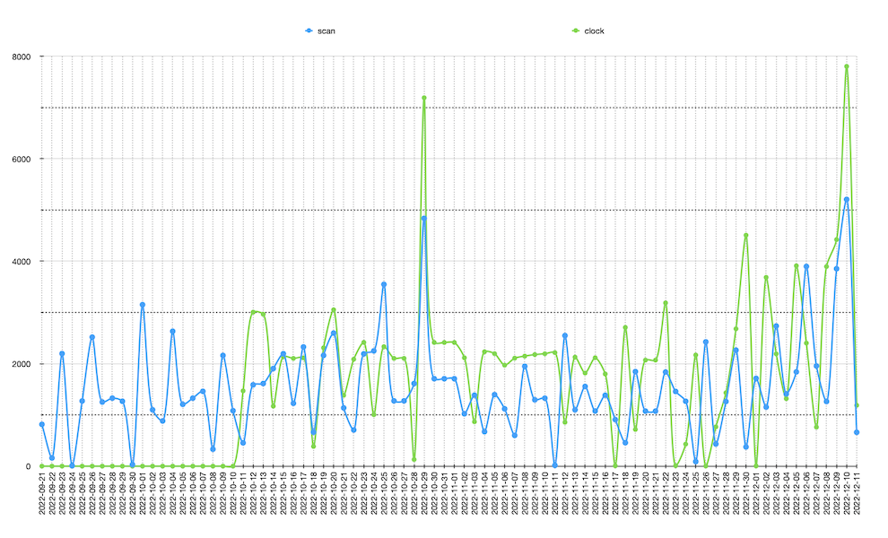

# Smoked by The House - Julia Rometti

Una raspberry pi llamada `tetecón` controló un par de aspiradoras, escáner y bocina inalámbrica en el marco de la exhibición "**Un millón setecientos sesenta y cuatro mil**", por Julia Rometti, Victor Costales y Rometti Costales, presentada en el Museo Anahuacalli de septiembre a diciembre 2022.

## Componentes

- Raspberry Pi 4b (8g)
- Yeedi K650
- Roomba 692
- Sony SRS-XB23

La computadora escanneaba el vacío continuamente, mientras una bocina—escondida dentro de un torso, sobre una de las aspiradoras—anuncia el tiempo cada diez segundos. La otra aspiradora alterna viajes procurando siempre tener al menos una aspiradora en funciones.

### Fierros

Systemd inicia servicios para autossh (porque necesité de un reverse proxy de ssh mediante un bastion host pa hacerme la vida más fácil) y para operar la conexión con la bocina bluetooth. Mediante un cron, `milpa` orquesta el reloj, scanner, aspiradoras y los anuncios del reloj.

```sh
# setup con:
mkdir /var/lib/sbth
git clone git@github.com:unRob/smoked-by-the-house.git /var/lib/sbth/code
cd /var/lib/sbth/code

# add a private ssh key at the right spot
cat "..." > /var/lib/sbth/id_ed25519
# populate known_hosts with bastion IP
echo "192.168.1.0 bastion" | sudo tee -a /etc/hosts

curl -L https://milpa.dev/install.sh | bash -
milpa setup
```

## Conclusiones

Implementé un rudimentario registro (`echo "" >> $(date)/{scan,clock}`) de la cantidad de veces que se ejecutaron exitosamente las rutinas del scanner (121,955) y el reloj (122,937), es decir al rededor de mil quinientas veces por día, o cada 20 segundos.


